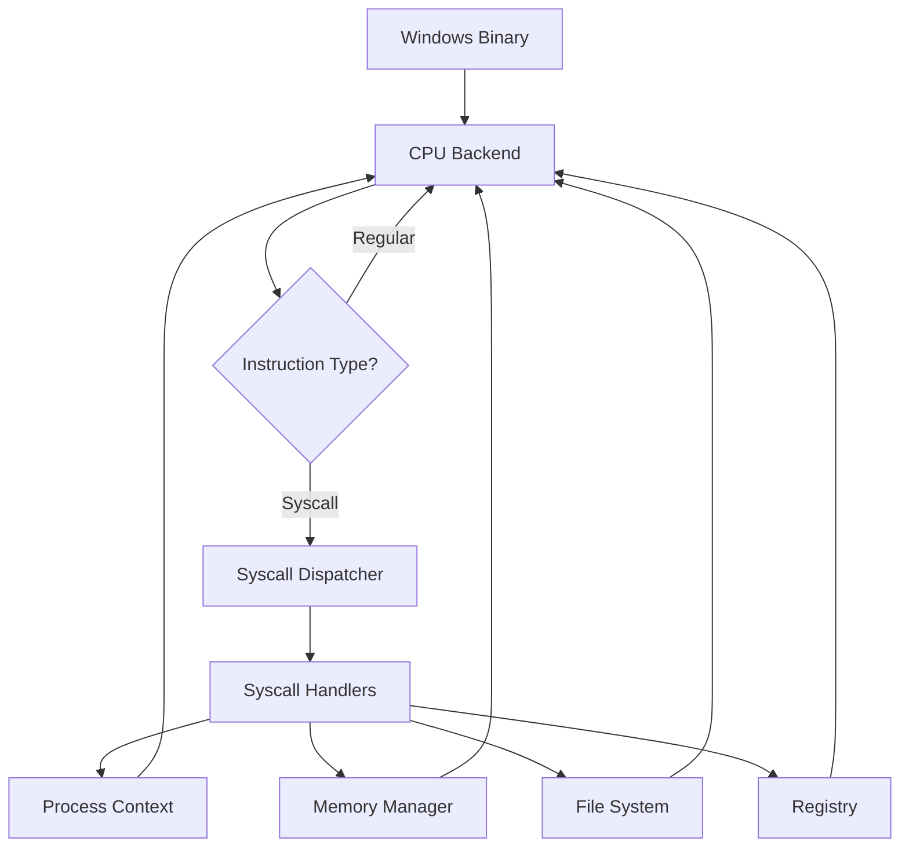
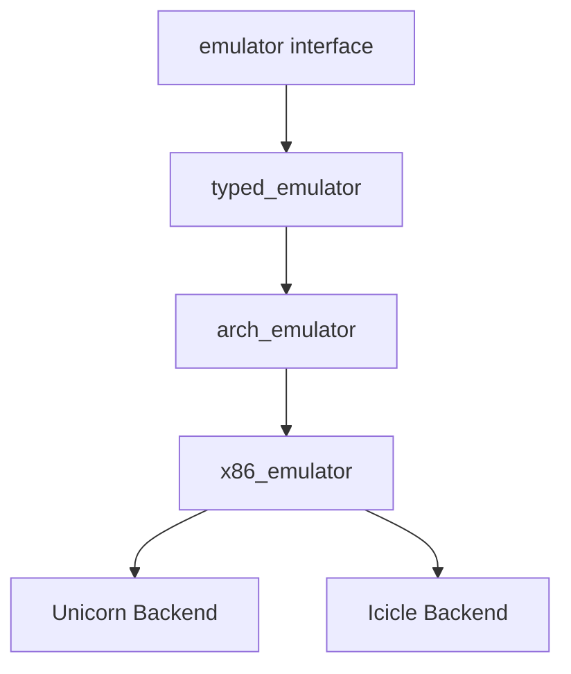

Sogen is a Windows user space emulator that runs Windows binaries on non-Windows platforms. Unlike traditional virtual machines that emulate the entire operating system, Sogen operates at the **syscall level**, providing a lightweight and efficient emulation layer.

## Core Design Principles

### Syscall-Level Emulation

Sogen emulates Windows by intercepting and handling Windows NT syscalls rather than emulating the entire kernel. When a Windows binary executes:

1. CPU instructions run natively (or through a CPU emulator backend)
2. When a `syscall` instruction is encountered, Sogen intercepts it
3. The syscall is dispatched to a handler that emulates Windows kernel behavior
4. Execution returns to the application

This approach provides several advantages:
- **Performance**: Most code runs at near-native speed
- **Compatibility**: Focus on API-level compatibility rather than hardware emulation
- **Flexibility**: Easy to add or modify syscall handlers without kernel development

## Architecture Overview



## Main Components

### windows_emulator

The `windows_emulator` class (defined in `windows_emulator.hpp:82`) is the central orchestrator:

```cpp
class windows_emulator
{
    std::unique_ptr<x86_64_emulator> emu_;      // CPU backend
    std::unique_ptr<utils::clock> clock_;       // Time management
    
public:
    logger log;                                  // Logging subsystem
    file_system file_sys;                       // Virtual file system
    memory_manager memory;                      // Memory management
    registry_manager registry;                  // Windows registry
    module_manager mod_manager;                 // DLL/module loading
    process_context process;                    // Process state
    syscall_dispatcher dispatcher;              // Syscall routing
};
```

This class manages:
- **Execution lifecycle**: Starting, stopping, and controlling binary execution
- **Component coordination**: Connecting subsystems (memory, file system, etc.)
- **Thread scheduling**: Round-robin cooperative multitasking
- **Hooks and callbacks**: Extensibility for analysis and instrumentation

### CPU Backend Abstraction

Sogen uses a pluggable backend architecture for CPU emulation:



The `emulator` interface (see `emulator/emulator.hpp:9`) provides three core interfaces:
- **cpu_interface**: Register access, instruction pointer control
- **memory_interface**: Read/write memory
- **hook_interface**: Attach hooks to instructions, memory access, etc.

Supported backends:
- **Unicorn**: Battle-tested, based on QEMU
- **Icicle**: High-performance JIT emulator

### Process Context

The `process_context` structure (see `process_context.hpp:39`) maintains all process-level state:

```cpp
struct process_context
{
    emulator_object<PEB64> peb64;                    // Process Environment Block
    emulator_object<RTL_USER_PROCESS_PARAMETERS64> process_params64;
    
    // Handle tables for different object types
    handle_store<handle_types::event, event> events;
    handle_store<handle_types::file, file> files;
    handle_store<handle_types::section, section> sections;
    handle_store<handle_types::thread, emulator_thread> threads;
    
    // WOW64 support for 32-bit processes
    bool is_wow64_process{false};
    std::optional<emulator_object<PEB32>> peb32;
    
    // Active thread
    emulator_thread* active_thread{nullptr};
};
```

Key responsibilities:
- **PEB/TEB management**: Windows process and thread environment blocks
- **Handle tables**: Kernel object handles (files, events, threads, etc.)
- **WOW64 support**: Running 32-bit binaries on 64-bit emulator
- **Thread management**: Thread storage and scheduling state

### Memory Manager

The `memory_manager` class wraps the backend's memory interface with Windows-specific semantics:

- **Region tracking**: Reserved vs. committed memory
- **Permission management**: Windows memory protection flags
- **Memory types**: Private allocations, mapped sections, MMIO regions
- **Allocation strategy**: Finding free memory regions

See [Memory Management](/concepts/memory-management) for details.

### Syscall Dispatcher

The `syscall_dispatcher` routes syscall requests to appropriate handlers:

1. Extracts syscall ID from `EAX` register
2. Looks up handler in the syscall table
3. Invokes handler with syscall context
4. Returns control to the emulated process

See [Syscall Emulation](/concepts/syscall-emulation) for details.

## Execution Flow

### Process Initialization

When starting a Windows binary:

1. **Parse PE file**: Extract executable headers and sections
2. **Map image**: Load executable into emulated memory
3. **Load dependencies**: Resolve imports, load required DLLs (ntdll.dll, kernel32.dll, etc.)
4. **Initialize process context**: Set up PEB, TEB, environment variables
5. **Create initial thread**: Set instruction pointer to entry point
6. **Start execution**: Begin instruction execution loop

### Instruction Execution Loop

From `windows_emulator.cpp:659`:

```cpp
void windows_emulator::start(size_t count)
{
    while (!should_stop)
    {
        // Execute instructions in time slices
        emu_->start(MAX_INSTRUCTIONS_PER_TIME_SLICE);
        
        // Perform thread switch if needed
        if (!this->perform_thread_switch())
        {
            break;
        }
    }
}
```

Each iteration:
1. Executes up to `MAX_INSTRUCTIONS_PER_TIME_SLICE` (0x20000) instructions
2. Checks for thread switches
3. Handles pending APCs, I/O completions, etc.
4. Switches to next ready thread (round-robin)

## WOW64 Support

Sogen supports running 32-bit Windows binaries through WOW64 emulation:

- **Dual PEB/TEB**: Maintains both 64-bit and 32-bit structures
- **Heaven's Gate**: Transitions between 32-bit and 64-bit mode
- **Syscall translation**: Maps 32-bit syscalls to 64-bit handlers
- **Thunking**: Converts data structures between 32-bit and 64-bit layouts

The `is_wow64_process` flag in process_context indicates whether the process is running in WOW64 mode.

## Extension Points

Sogen provides several hooks for instrumentation and analysis:

```cpp
struct emulator_callbacks
{
    opt_func<void(uint64_t address)> on_instruction;           // Every instruction
    opt_func<continuation(uint32_t id, string_view name)> on_syscall;  // Syscall intercept
    opt_func<void(uint64_t addr, uint64_t len, memory_permission)> on_memory_allocate;
    opt_func<void(uint64_t addr, memory_operation, memory_violation_type)> on_memory_violate;
    opt_func<void(string_view data)> on_stdout;                // Output capture
    opt_func<void()> on_exception;                             // Exception handler
};
```

These callbacks enable:
- **Tracing**: Log every instruction, syscall, memory access
- **Analysis**: Detect suspicious behavior, track data flow
- **Debugging**: Breakpoints, single-stepping, inspection
- **Modification**: Change syscall behavior, inject code

## Next Steps

- [Syscall Emulation](/concepts/syscall-emulation) - How syscalls are intercepted and dispatched
- [Memory Management](/concepts/memory-management) - Windows memory model implementation
- [Threading](/concepts/threading) - Round-robin cooperative multitasking
- [Exception Handling](/concepts/exception-handling) - SEH and vectored exception handling