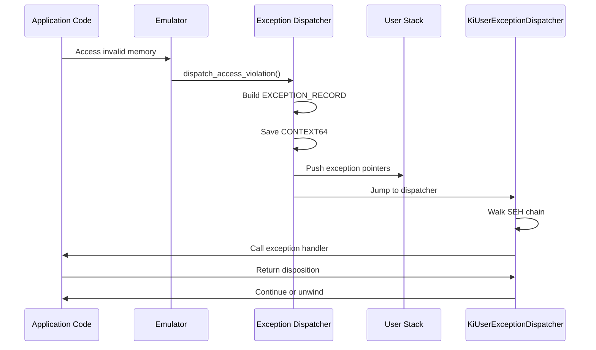

Sogen implements Windows Structured Exception Handling (SEH), allowing applications to catch and handle hardware and software exceptions. This is critical for running real-world Windows binaries that rely on exception handling for error recovery and control flow.

## Exception Types

Windows exceptions fall into several categories:

### Hardware Exceptions

- **Access Violation** (`STATUS_ACCESS_VIOLATION`): Reading/writing unmapped or protected memory
- **Guard Page Violation** (`STATUS_GUARD_PAGE_VIOLATION`): Accessing guard page (one-time exception)
- **Illegal Instruction** (`STATUS_ILLEGAL_INSTRUCTION`): Invalid opcode
- **Integer Division by Zero** (`STATUS_INTEGER_DIVIDE_BY_ZERO`): Division by zero
- **Single Step** (`STATUS_SINGLE_STEP`): Debug trap flag set
- **Breakpoint** (`STATUS_BREAKPOINT`): INT3 instruction

### Software Exceptions

- **Raised Exception** (`NtRaiseException`): Application-generated exception
- **Hard Error** (`NtRaiseHardError`): Critical system error

## Exception Record

Exceptions are represented by `EXCEPTION_RECORD` structures:

```cpp
template<typename Traits>
struct EMU_EXCEPTION_RECORD
{
    DWORD ExceptionCode;                   // STATUS_* code
    DWORD ExceptionFlags;                  // EH_NONCONTINUABLE, etc.
    typename Traits::PVOID ExceptionRecord;  // Nested exception
    typename Traits::PVOID ExceptionAddress; // Where exception occurred
    DWORD NumberParameters;                // Parameter count
    typename Traits::ULONG_PTR ExceptionInformation[15];  // Additional info
};
```

For access violations, `ExceptionInformation` contains:
- `[0]`: Operation type (0=read, 1=write, 8=DEP violation)
- `[1]`: Virtual address that caused the fault

## Exception Dispatch Flow



## Exception Dispatch Implementation

### Triggering an Exception

From `exception_dispatch.cpp:212`:

```cpp
void dispatch_exception(windows_emulator& win_emu,
                       DWORD status,
                       const vector<uint64_t>& parameters)
{
    // Save current CPU state
    CONTEXT64 ctx{};
    ctx.ContextFlags = CONTEXT64_ALL;
    cpu_context::save(win_emu.emu(), ctx);
    ctx.Rip = win_emu.current_thread().current_ip;
    
    // Build exception record
    exception_record record{};
    memset(&record, 0, sizeof(record));
    record.ExceptionCode = status;
    record.ExceptionFlags = 0;
    record.ExceptionAddress = ctx.Rip;
    record.NumberParameters = static_cast<DWORD>(parameters.size());
    
    // Copy parameters
    for (size_t i = 0; i < parameters.size(); ++i)
    {
        record.ExceptionInformation[i] = parameters[i];
    }
    
    // Build exception pointers
    EMU_EXCEPTION_POINTERS<EmulatorTraits<Emu64>> pointers{};
    pointers.ContextRecord = reinterpret_cast<uint64_t>(&ctx);
    pointers.ExceptionRecord = reinterpret_cast<uint64_t>(&record);
    
    // Dispatch to user mode
    dispatch_exception_pointers(win_emu.emu(),
                               win_emu.process.ki_user_exception_dispatcher,
                               pointers);
}
```

### Stack Layout

The exception dispatcher builds a specific stack layout:

```cpp
void dispatch_exception_pointers(x86_64_emulator& emu,
                                uint64_t dispatcher,
                                const EMU_EXCEPTION_POINTERS pointers)
{
    constexpr auto mach_frame_size = 0x40;
    constexpr auto context_record_size = 0x4F0;  // sizeof(CONTEXT64)
    const auto exception_record_size = calculate_exception_record_size(...);
    const auto combined_size = align_up(
        exception_record_size + context_record_size, 0x10);
    const auto allocation_size = combined_size + mach_frame_size;
    
    // Allocate on stack
    const auto initial_sp = emu.reg(x86_register::rsp);
    const auto new_sp = align_down(initial_sp - allocation_size, 0x100);
    
    // Zero memory
    vector<uint8_t> zero_memory(initial_sp - new_sp, 0);
    emu.write_memory(new_sp, zero_memory.data(), zero_memory.size());
    
    // Write CONTEXT64
    emulator_object<CONTEXT64> context_record_obj{emu, new_sp};
    context_record_obj.write(*reinterpret_cast<CONTEXT64*>(
        pointers.ContextRecord));
    
    // Write EXCEPTION_RECORD
    emulator_allocator allocator{emu, new_sp + context_record_size,
                                exception_record_size};
    const auto exception_record_obj = save_exception_record(allocator,
        *reinterpret_cast<exception_record*>(pointers.ExceptionRecord));
    
    // Write machine frame (for IRET)
    emulator_object<machine_frame> machine_frame_obj{emu,
                                                     new_sp + combined_size};
    machine_frame_obj.access([&](machine_frame& frame) {
        const auto& record = *reinterpret_cast<CONTEXT64*>(
            pointers.ContextRecord);
        frame.rip = record.Rip;
        frame.rsp = record.Rsp;
        frame.ss = record.SegSs;
        frame.cs = record.SegCs;
        frame.eflags = record.EFlags;
    });
    
    // Update CPU state
    emu.reg(x86_register::rsp, new_sp);
    emu.reg(x86_register::rip, dispatcher);
}
```

Stack layout after exception dispatch:

```
┌─────────────────────┐ ← initial_sp
│                     │
├─────────────────────┤ ← new_sp
│ CONTEXT64 (0x4F0)  │
├─────────────────────┤
│ EXCEPTION_RECORD    │
├─────────────────────┤
│ Machine Frame       │
│  - RIP             │
│  - CS              │
│  - RFLAGS          │
│  - RSP             │
│  - SS              │
└─────────────────────┘
```

## Specific Exception Types

### Access Violation

From `exception_dispatch.cpp:256`:

```cpp
void dispatch_access_violation(windows_emulator& win_emu,
                              uint64_t address,
                              memory_operation operation)
{
    dispatch_exception(win_emu, STATUS_ACCESS_VIOLATION,
    {
        map_violation_operation_to_parameter(operation),  // 0=read, 1=write
        address,                                         // Faulting address
    });
}
```

This is called from the memory subsystem when:
- Reading unmapped memory
- Writing read-only memory
- Executing non-executable memory

### Guard Page Violation

```cpp
void dispatch_guard_page_violation(windows_emulator& win_emu,
                                  uint64_t address,
                                  memory_operation operation)
{
    dispatch_exception(win_emu, STATUS_GUARD_PAGE_VIOLATION,
    {
        map_violation_operation_to_parameter(operation),
        address,
    });
}
```

Guard pages are used for:
- **Stack growth detection**: Automatically commit stack pages
- **Heap debugging**: Detect buffer overruns
- **Copy-on-write**: Implement lazy copying

### Illegal Instruction

```cpp
void dispatch_illegal_instruction_violation(windows_emulator& win_emu)
{
    dispatch_exception(win_emu, STATUS_ILLEGAL_INSTRUCTION, {});
}
```

Caught by the CPU backend when encountering invalid opcodes.

### Breakpoint

```cpp
void dispatch_breakpoint(windows_emulator& win_emu)
{
    dispatch_exception(win_emu, STATUS_BREAKPOINT, {});
}
```

Triggered by `INT3` instruction (opcode `0xCC`), commonly used by debuggers.

### Single Step

```cpp
void dispatch_single_step(windows_emulator& win_emu)
{
    dispatch_exception(win_emu, STATUS_SINGLE_STEP, {});
}
```

Called after each instruction when the trap flag (TF) in RFLAGS is set.

## Debug Exceptions

Windows has special handling for `INT 2Dh` instructions used by debuggers:

From `exception_dispatch.cpp:157`:

```cpp
bool dispatch_debug_exception(windows_emulator& win_emu,
                             CONTEXT64& ctx,
                             EMU_EXCEPTION_RECORD& record)
{
    array<uint8_t, 2> ins = {0};
    
    // Check for "INT 2Dh" instruction
    if (win_emu.memory.try_read_memory(ctx.Rip, &ins, sizeof(ins)) &&
        ins[0] == 0xCD && ins[1] == 0x2D)
    {
        ctx.Rip += 2;  // Skip instruction
        
        record.NumberParameters = 3;
        record.ExceptionInformation[0] = ctx.Rax;  // Service type
        record.ExceptionInformation[1] = ctx.Rcx;  // Parameter 1
        record.ExceptionInformation[2] = ctx.Rdx;  // Parameter 2
        
        // Adjust RIP based on service type
        switch (ctx.Rax)
        {
        case BREAKPOINT_BREAK:            // Drop into debugger
            break;
        case BREAKPOINT_PRINT:            // Print debug string
        case BREAKPOINT_LOAD_SYMBOLS:     // Load symbols
        case BREAKPOINT_UNLOAD_SYMBOLS:   // Unload symbols
        case BREAKPOINT_COMMAND_STRING:   // Execute command
            ctx.Rip += 3;  // Skip additional bytes
            break;
        }
        
        return true;
    }
    
    return false;
}
```

## Exception Continuation

After handling an exception, applications can:

1. **Continue execution**: Resume at the faulting instruction
2. **Continue search**: Let the next handler try
3. **Unwind**: Clean up and propagate exception

This is handled by the `NtContinue` syscall:

```cpp
NTSTATUS handle_NtContinue(const syscall_context& c,
                          emulator_object<CONTEXT64> context_record,
                          BOOLEAN test_alert)
{
    // Restore CPU state from context
    const auto ctx = context_record.read();
    cpu_context::restore(c.emu, ctx);
    
    // Check for pending APCs
    if (test_alert && c.win_emu.current_thread().apc_alertable)
    {
        if (!c.win_emu.current_thread().pending_apcs.empty())
        {
            dispatch_next_apc(c.win_emu, c.win_emu.current_thread());
            return STATUS_SUCCESS;
        }
    }
    
    // Execution continues from context.Rip
    return STATUS_SUCCESS;
}
```

## Raised Exceptions

Applications can manually raise exceptions:

```cpp
NTSTATUS handle_NtRaiseException(
    const syscall_context& c,
    emulator_object<EMU_EXCEPTION_RECORD<EmulatorTraits<Emu64>>> exception_record,
    emulator_object<CONTEXT64> thread_context,
    BOOLEAN handle_exception)
{
    const auto record = exception_record.read();
    
    if (handle_exception)
    {
        // Dispatch through normal SEH mechanism
        dispatch_exception(c.win_emu, record.ExceptionCode,
                         vector<uint64_t>(record.ExceptionInformation,
                                        record.ExceptionInformation +
                                        record.NumberParameters));
    }
    else
    {
        // Terminate process
        c.proc.exit_status = record.ExceptionCode;
        c.win_emu.stop();
    }
    
    return STATUS_SUCCESS;
}
```

## WOW64 Exception Handling

For 32-bit processes running under WOW64, exception dispatch uses the "Heaven's Gate" mechanism to transition between 32-bit and 64-bit mode:

```cpp
// Check if we're in 32-bit mode
const auto cs_selector = emu.reg<uint16_t>(x86_register::cs);
const auto bitness = segment_utils::get_segment_bitness(emu, cs_selector);

if (bitness && *bitness == segment_utils::segment_bitness::bit32)
{
    // Set up for Heaven's Gate transition
    emu.reg(x86_register::rax, dispatcher);  // 64-bit dispatcher address
    emu.reg(x86_register::rbx, new_sp);      // Stack pointer
    emu.reg(x86_register::rcx, kUserCodeSelector);  // 64-bit CS
    emu.reg(x86_register::rdx, kUserStackSelector); // 64-bit SS
    emu.reg(x86_register::rsp, kStackTop);   // Heaven's Gate stack
    emu.reg(x86_register::rip, kCodeBase);   // Heaven's Gate trampoline
}
else
{
    // Native 64-bit exception dispatch
    emu.reg(x86_register::rsp, new_sp);
    emu.reg(x86_register::rip, dispatcher);
}
```

This ensures exception handling works correctly for both 32-bit and 64-bit code.

## Exception Callbacks

Sogen provides hooks for exception monitoring:

```cpp
struct emulator_callbacks
{
    opt_func<void()> on_exception;  // Called on any exception
};
```

This enables:
- **Logging**: Record exception types and locations
- **Analysis**: Detect exception-based anti-analysis
- **Debugging**: Break on specific exception types
- **Fuzzing**: Track exception coverage

## Next Steps

- [Architecture](/concepts/architecture) - Overall emulator design
- [Syscall Emulation](/concepts/syscall-emulation) - Exception-related syscalls
- [Memory Management](/concepts/memory-management) - Access violations and guard pages
- [Threading](/concepts/threading) - Per-thread exception handling