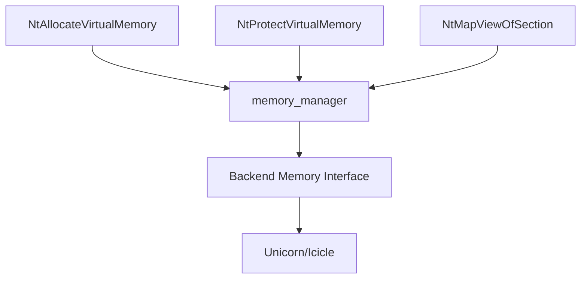

Sogen's memory manager emulates the Windows virtual memory subsystem, providing applications with the familiar Windows memory model while mapping operations to the underlying CPU backend.

## Overview

The `memory_manager` class (defined in `memory_manager.hpp:50`) sits between Windows syscalls and the CPU backend's memory interface:



It maintains Windows-specific metadata (region types, permissions, committed vs. reserved) while delegating actual memory operations to the backend.

## Memory Regions

### Region Types

Windows distinguishes between several memory region types (from `memory_manager.hpp:20`):

```cpp
enum class memory_region_kind : uint8_t
{
    free = 0,              // Unallocated
    private_allocation,    // VirtualAlloc memory
    section_view,          // Mapped file/section
    section_image,         // Mapped PE image (DLL/EXE)
    mmio,                  // Memory-mapped I/O
};
```

Each type has different behavior:
- **private_allocation**: Standard heap/stack memory, can be freed with `VirtualFree`
- **section_view**: File-backed memory, must be unmapped with `UnmapViewOfSection`
- **section_image**: Executable images, may have relocations and import tables
- **mmio**: Special memory with read/write callbacks (e.g., KUSER_SHARED_DATA)

### Reserved vs. Committed

Windows has a two-phase allocation model:

1. **Reserve**: Allocate address space but no physical memory
2. **Commit**: Allocate actual memory within reserved region

```cpp
struct reserved_region
{
    size_t length;                            // Total reserved size
    memory_permission initial_permission;     // Default permission
    committed_region_map committed_regions;   // Committed subranges
    memory_region_kind kind;                  // Region type
};

struct committed_region  
{
    size_t length;                // Committed size
    nt_memory_permission permissions;  // Access permissions
};
```

From `memory_manager.hpp:66-72`.

### Region Info

Applications query memory via `NtQueryVirtualMemory`, which returns:

```cpp
struct region_info
{
    uint64_t base;                    // Region start address
    size_t length;                    // Region size
    uint64_t allocation_base;         // Base of allocation
    size_t allocation_length;         // Size of allocation
    bool is_reserved;                 // Reserved?
    bool is_committed;                // Committed?
    nt_memory_permission permissions; // Current permissions
    nt_memory_permission initial_permissions;  // Original permissions
    memory_region_kind kind;          // Region type
};
```

## Memory Permissions

Windows uses fine-grained memory protection flags:

```cpp
enum class nt_memory_permission : uint32_t
{
    none = 0,
    readonly = PAGE_READONLY,              // R--
    readwrite = PAGE_READWRITE,            // RW-
    execute = PAGE_EXECUTE,                // --X
    execute_read = PAGE_EXECUTE_READ,      // R-X
    execute_readwrite = PAGE_EXECUTE_READWRITE,  // RWX
    guard = PAGE_GUARD,                    // Guard page (one-time exception)
    nocache = PAGE_NOCACHE,                // No CPU cache
};
```

These are translated to backend permissions:

```cpp
enum class memory_permission
{
    none,       // ---
    read,       // R--
    write,      // -W-  (implies read on most architectures)
    read_write, // RW-
    exec,       // --X
    read_exec,  // R-X
    all,        // RWX
};
```

## Memory Operations

### Allocation

From `memory_manager.cpp`:

```cpp
bool memory_manager::allocate_memory(uint64_t address, size_t size,
                                    nt_memory_permission permissions,
                                    bool reserve_only,
                                    memory_region_kind kind)
{
    // Align to allocation granularity (64KB)
    address = align_down(address, ALLOCATION_GRANULARITY);
    size = align_up(size, ALLOCATION_GRANULARITY);
    
    // Check for conflicts
    if (overlaps_reserved_region(address, size))
        return false;
    
    // Create reserved region
    reserved_region region{
        .length = size,
        .initial_permission = to_memory_permission(permissions),
        .kind = kind,
    };
    
    // Commit if requested
    if (!reserve_only)
    {
        region.committed_regions[address] = committed_region{
            .length = size,
            .permissions = permissions,
        };
        
        // Map in backend
        this->map_memory(address, size, to_memory_permission(permissions));
    }
    
    // Store region metadata
    this->reserved_regions_[address] = std::move(region);
    this->update_layout_version();
    
    return true;
}
```

### Finding Free Space

When applications request memory without specifying an address:

```cpp
uint64_t memory_manager::find_free_allocation_base(size_t size,
                                                  uint64_t start) const
{
    // Align to allocation granularity
    size = align_up(size, ALLOCATION_GRANULARITY);
    start = align_up(std::max(start, MIN_ALLOCATION_ADDRESS),
                     ALLOCATION_GRANULARITY);
    
    // Iterate through reserved regions
    for (const auto& [addr, region] : this->reserved_regions_)
    {
        // Check gap before this region
        if (start + size <= addr)
            return start;
        
        // Move past this region
        start = align_up(addr + region.length, ALLOCATION_GRANULARITY);
    }
    
    // Check final gap
    if (start + size <= MAX_ALLOCATION_END_EXCL)
        return start;
    
    return 0;  // No space found
}
```

Address space layout:

```
0x0000000000000000 - 0x0000000000010000: NULL region (inaccessible)
0x0000000000010000 - 0x00007FFFFFFE0000: User address space
0x00007FFFFFFE0000 - 0xFFFFFFFFFFFFFFFF: Kernel address space (inaccessible)
```

From `memory_manager.hpp:13-16`.

### Committing Memory

```cpp
bool memory_manager::commit_memory(uint64_t address, size_t size,
                                  nt_memory_permission permissions)
{
    // Find containing reserved region
    auto region_iter = find_reserved_region(address);
    if (region_iter == reserved_regions_.end())
        return false;
    
    auto& region = region_iter->second;
    
    // Split existing committed regions at boundaries
    split_regions(region.committed_regions, {address, address + size});
    
    // Mark range as committed
    region.committed_regions[address] = committed_region{
        .length = size,
        .permissions = permissions,
    };
    
    // Merge adjacent regions with same permissions
    merge_regions(region.committed_regions);
    
    // Map in backend
    this->map_memory(address, size, to_memory_permission(permissions));
    
    this->update_layout_version();
    return true;
}
```

### Decommitting Memory

```cpp
bool memory_manager::decommit_memory(uint64_t address, size_t size)
{
    auto region_iter = find_reserved_region(address);
    if (region_iter == reserved_regions_.end())
        return false;
    
    auto& region = region_iter->second;
    
    // Remove committed regions in range
    for (auto it = region.committed_regions.begin();
         it != region.committed_regions.end();)
    {
        const auto [com_addr, com_region] = *it;
        const auto com_end = com_addr + com_region.length;
        
        if (overlaps(com_addr, com_end, address, address + size))
        {
            // Unmap from backend
            this->unmap_memory(com_addr, com_region.length);
            it = region.committed_regions.erase(it);
        }
        else
        {
            ++it;
        }
    }
    
    this->update_layout_version();
    return true;
}
```

### Protection Changes

```cpp
bool memory_manager::protect_memory(uint64_t address, size_t size,
                                   nt_memory_permission permissions,
                                   nt_memory_permission* old_permissions)
{
    auto region_iter = find_reserved_region(address);
    if (region_iter == reserved_regions_.end())
        return false;
    
    auto& region = region_iter->second;
    
    // Find committed region
    for (auto& [addr, com_region] : region.committed_regions)
    {
        if (addr == address && com_region.length == size)
        {
            // Save old permissions
            if (old_permissions)
                *old_permissions = com_region.permissions;
            
            // Update permissions
            com_region.permissions = permissions;
            
            // Apply to backend
            this->apply_memory_protection(address, size,
                                         to_memory_permission(permissions));
            
            return true;
        }
    }
    
    return false;
}
```

## Special Memory Regions

### KUSER_SHARED_DATA

Windows exposes read-only kernel data at a fixed address (`0x7FFE0000`). Sogen implements this as MMIO:

```cpp
// From kusd_mmio.cpp
bool allocate_kusd_mmio(memory_manager& memory)
{
    return memory.allocate_mmio(
        KUSD_ADDRESS,
        sizeof(KUSER_SHARED_DATA),
        // Read callback
        [](uint64_t addr, void* data, size_t size) {
            // Return current time, tick count, etc.
            populate_kusd_data(addr, data, size);
        },
        // Write callback (no-op, read-only)
        [](uint64_t addr, const void* data, size_t size) {}
    );
}
```

### Process Environment Block (PEB)

The PEB is allocated in a special segment:

```cpp
// From process_context.cpp
#define PEB_SEGMENT_SIZE (20 << 20)  // 20 MB

emulator_allocator base_allocator = 
    create_allocator(memory, PEB_SEGMENT_SIZE, is_wow64_process);

emulator_object<PEB64> peb64{base_allocator.reserve<PEB64>()};
```

### Thread Environment Block (TEB)

Each thread has a TEB accessed via the GS segment register:

```cpp
// From emulator_thread.cpp
std::optional<emulator_allocator> gs_segment;
std::optional<emulator_object<TEB64>> teb64;

// Set GS base to TEB address
emu.set_segment_base(x86_register::gs, teb64->value());
```

## Memory-Mapped Files

Sections can be mapped into memory:

```cpp
NTSTATUS handle_NtMapViewOfSection(const syscall_context& c,
                                   handle section_handle,
                                   emulator_object<uint64_t> base_address,
                                   emulator_object<size_t> view_size,
                                   ULONG allocation_type,
                                   ULONG protect)
{
    auto* section = c.proc.sections.get(section_handle);
    if (!section)
        return STATUS_INVALID_HANDLE;
    
    auto addr = base_address.read();
    auto size = view_size.read();
    
    // Find free address if needed
    if (addr == 0)
        addr = c.win_emu.memory.find_free_allocation_base(size);
    
    // Allocate as section view
    const auto perms = translate_permissions(protect);
    c.win_emu.memory.allocate_memory(addr, size, perms, false,
                                    memory_region_kind::section_view);
    
    // Copy section data
    c.emu.write_memory(addr, section->data.data(), section->data.size());
    
    base_address.write(addr);
    view_size.write(size);
    
    return STATUS_SUCCESS;
}
```

## Memory Statistics

The memory manager tracks usage:

```cpp
struct memory_stats
{
    uint64_t reserved_memory = 0;   // Total reserved
    uint64_t committed_memory = 0;  // Total committed
};

memory_stats memory_manager::compute_memory_stats() const
{
    memory_stats stats{};
    
    for (const auto& [addr, region] : this->reserved_regions_)
    {
        stats.reserved_memory += region.length;
        
        for (const auto& [com_addr, com_region] : region.committed_regions)
        {
            stats.committed_memory += com_region.length;
        }
    }
    
    return stats;
}
```

## Layout Versioning

The memory manager maintains a version counter for the memory layout:

```cpp
std::atomic<uint64_t> layout_version_{0};

void memory_manager::update_layout_version()
{
    this->layout_version_.fetch_add(1, std::memory_order_relaxed);
}
```

This allows other components to detect when the memory layout has changed and invalidate caches.

## Next Steps

- [Architecture](/concepts/architecture) - Overall emulator design
- [Syscall Emulation](/concepts/syscall-emulation) - Memory-related syscalls
- [Threading](/concepts/threading) - Thread stack allocation
- [Exception Handling](/concepts/exception-handling) - Access violations and guard pages