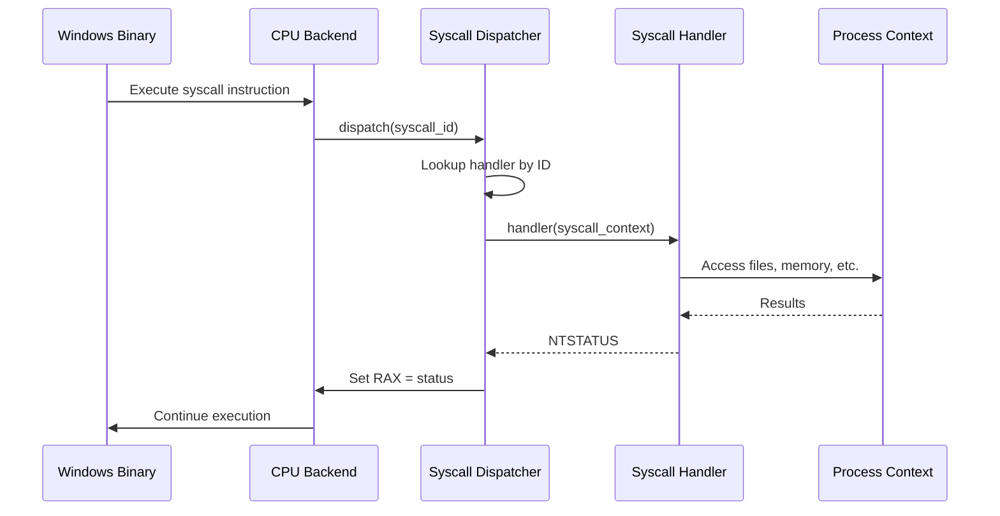

Syscall emulation is the core mechanism that allows Sogen to run Windows binaries without a Windows kernel. This page explains how syscalls are intercepted, dispatched, and handled.

## Overview

Windows applications interact with the kernel through NT syscalls. In Sogen:

1. The CPU backend hooks the `syscall` instruction
2. When executed, control transfers to the syscall dispatcher
3. The dispatcher looks up and invokes the appropriate handler
4. The handler emulates kernel behavior
5. Control returns to the application with results



## Syscall Discovery

Syscalls in Windows are not statically numbered—each Windows version may have different syscall IDs. Sogen discovers syscall numbers dynamically by analyzing the actual ntdll.dll and win32u.dll modules.

### Extraction Process

From `syscall_dispatcher.cpp:28`:

```cpp
void syscall_dispatcher::setup(const exported_symbols& ntdll_exports,
                              const span<const byte> ntdll_data,
                              const exported_symbols& win32u_exports,
                              const span<const byte> win32u_data)
{
    this->handlers_ = {};
    
    // Extract syscall numbers from DLL code
    const auto ntdll_syscalls = find_syscalls(ntdll_exports, ntdll_data);
    const auto win32u_syscalls = find_syscalls(win32u_exports, win32u_data);
    
    // Build syscall ID -> name mapping
    map_syscalls(this->handlers_, ntdll_syscalls);
    map_syscalls(this->handlers_, win32u_syscalls);
    
    // Associate handlers
    this->add_handlers();
}
```

The `find_syscalls` function searches for the syscall stub pattern:

```asm
mov r10, rcx        ; Save first argument
mov eax, <syscall_id>
syscall
ret
```

By pattern matching against exported functions starting with `Nt` or `Zw`, Sogen builds a complete syscall table for the target Windows version.

## Syscall Dispatch

### Dispatch Entry Point

When the CPU backend encounters a `syscall` instruction, it calls `syscall_dispatcher::dispatch()` (from `syscall_dispatcher.cpp:64`):

```cpp
void syscall_dispatcher::dispatch(windows_emulator& win_emu)
{
    auto& emu = win_emu.emu();
    
    // Extract syscall ID from EAX (lower 16 bits for WOW64 compat)
    const auto raw_syscall_id = emu.reg<uint32_t>(x86_register::eax);
    const auto syscall_id = raw_syscall_id & 0xFFFF;
    
    // Lookup handler
    const auto entry = this->handlers_.find(syscall_id);
    
    // Build syscall context
    const syscall_context c{
        .win_emu = win_emu,
        .emu = emu,
        .proc = context,
        .write_status = true,
    };
    
    // Invoke callback for instrumentation
    const auto res = win_emu.callbacks.on_syscall(syscall_id, entry->second.name);
    if (res == instruction_hook_continuation::skip_instruction)
        return;
    
    // Call handler
    if (entry->second.handler)
    {
        entry->second.handler(c);
    }
}
```

### Syscall Context

The `syscall_context` provides handlers with access to:

```cpp
struct syscall_context
{
    windows_emulator& win_emu;   // Full emulator state
    x86_64_emulator& emu;        // CPU registers/memory
    process_context& proc;       // Process state
    bool write_status;           // Whether to set RAX
};
```

Handlers extract arguments from registers following the Windows x64 calling convention:
- RCX: First argument
- RDX: Second argument  
- R8: Third argument
- R9: Fourth argument
- Stack: Additional arguments

## Syscall Handlers

Sogen implements hundreds of syscall handlers across different categories:

### File Operations

From `syscalls/file.cpp`:

```cpp
NTSTATUS handle_NtCreateFile(const syscall_context& c,
                             emulator_object<handle> file_handle,
                             ACCESS_MASK desired_access,
                             emulator_object<OBJECT_ATTRIBUTES> object_attributes,
                             emulator_object<IO_STATUS_BLOCK> io_status_block,
                             ...)
{
    // Read object attributes from emulated memory
    const auto obj_attr = object_attributes.read();
    const auto path = read_unicode_string(c.emu, obj_attr.ObjectName);
    
    // Map Windows path to host path
    const auto host_path = c.win_emu.file_sys.get_path(path);
    
    // Create file object
    file f = create_file(host_path, desired_access, ...);
    
    // Store in handle table
    const auto h = c.proc.files.store(std::move(f));
    file_handle.write(h);
    
    return STATUS_SUCCESS;
}
```

### Memory Operations

From `syscalls/memory.cpp`:

```cpp  
NTSTATUS handle_NtAllocateVirtualMemory(const syscall_context& c,
                                       handle process_handle,
                                       emulator_object<uint64_t> base_address,
                                       emulator_object<uint64_t> region_size,
                                       ULONG allocation_type,
                                       ULONG protect)
{
    auto addr = base_address.read();
    auto size = region_size.read();
    
    // Convert Windows protection to memory_permission
    const auto perms = translate_permissions(protect);
    
    // Allocate in memory manager
    if (addr == 0)
    {
        addr = c.win_emu.memory.allocate_memory(size, perms,
                                               allocation_type & MEM_RESERVE);
    }
    else
    {
        c.win_emu.memory.allocate_memory(addr, size, perms,
                                        allocation_type & MEM_RESERVE);
    }
    
    // Write results back
    base_address.write(addr);
    region_size.write(size);
    
    return STATUS_SUCCESS;
}
```

### Thread Operations

From `syscalls/thread.cpp`:

```cpp
NTSTATUS handle_NtCreateThreadEx(const syscall_context& c,
                                emulator_object<handle> thread_handle,
                                ACCESS_MASK desired_access,
                                uint64_t start_address,
                                uint64_t argument,
                                ULONG create_flags,
                                ...)
{
    // Create thread in process context
    const auto h = c.proc.create_thread(c.win_emu.memory,
                                       start_address,
                                       argument,
                                       STACK_SIZE,
                                       create_flags);
    
    thread_handle.write(h);
    
    return STATUS_SUCCESS;
}
```

## Handler Categories

Syscall handlers are organized by functionality:

| Category | File | Examples |
|----------|------|----------|
| **File I/O** | `syscalls/file.cpp` | NtCreateFile, NtReadFile, NtWriteFile, NtQueryInformationFile |
| **Memory** | `syscalls/memory.cpp` | NtAllocateVirtualMemory, NtProtectVirtualMemory, NtQueryVirtualMemory |
| **Thread** | `syscalls/thread.cpp` | NtCreateThreadEx, NtTerminateThread, NtSuspendThread, NtResumeThread |
| **Process** | `syscalls/process.cpp` | NtQueryInformationProcess, NtSetInformationProcess |
| **Synchronization** | `syscalls/event.cpp`, `syscalls/mutant.cpp` | NtCreateEvent, NtSetEvent, NtWaitForSingleObject |
| **Registry** | `syscalls/registry.cpp` | NtOpenKey, NtQueryValueKey, NtSetValueKey |
| **Sections** | `syscalls/section.cpp` | NtCreateSection, NtMapViewOfSection, NtUnmapViewOfSection |
| **Exception** | `syscalls/exception.cpp` | NtRaiseException, NtContinue |
| **GDI/User** | `syscalls/gdi.cpp`, `syscalls/user.cpp` | NtGdiCreateDC, NtUserCreateWindowEx |

## Return Values

Syscall handlers return `NTSTATUS` codes:

```cpp
#define STATUS_SUCCESS                  0x00000000
#define STATUS_NOT_SUPPORTED            0xC00000BB
#define STATUS_INVALID_PARAMETER        0xC000000D
#define STATUS_ACCESS_DENIED            0xC0000022
#define STATUS_OBJECT_NAME_NOT_FOUND    0xC0000034
```

The dispatcher writes the return value to the `RAX` register, matching Windows syscall convention.

## User Callbacks

Some syscalls require callbacks into user mode (e.g., window procedures). Sogen handles this through a callback stack:

```cpp
struct callback_frame
{
    callback_id handler_id;           // What callback is active
    uint64_t rip, rsp;               // Saved registers
    uint64_t rcx, rdx, r8, r9;       // Saved arguments
    std::unique_ptr<completion_state> state;  // Handler state
};
```

From `emulator_thread.hpp:271`:

```cpp
std::vector<callback_frame> callback_stack;
```

### Callback Dispatch Flow

1. Syscall handler needs user callback (e.g., window creation)
2. Create `callback_frame` with current register state
3. Set `RIP` to callback function in user code
4. Execute user callback code
5. Callback returns via `NtCallbackReturn`
6. Restore registers from `callback_frame`
7. Resume syscall handler with callback result

This enables complex operations like window creation that require multiple round-trips between kernel and user mode.

## Unimplemented Syscalls

When a syscall is not implemented:

```cpp
if (!entry->second.handler)
{
    win_emu.log.print("Unimplemented syscall: %s\n", syscall_name);
    c.emu.reg<uint64_t>(x86_register::rax, STATUS_NOT_SUPPORTED);
    return;
}
```

The emulator logs the call and returns `STATUS_NOT_SUPPORTED`. Applications typically have fallback behavior for unsupported features.

## Instrumentation Hooks

The `on_syscall` callback allows instrumentation before handler execution:

```cpp
const auto res = win_emu.callbacks.on_syscall(syscall_id, entry->second.name);
if (res == instruction_hook_continuation::skip_instruction)
    return;  // Callback handled the syscall
```

This enables:
- **Logging**: Record all syscalls with arguments
- **Modification**: Change arguments before handler
- **Replacement**: Implement custom syscall behavior
- **Blocking**: Prevent certain syscalls from executing

## WOW64 Syscalls

32-bit processes use a different syscall mechanism. Sogen handles this through:

1. **Syscall ID masking**: `syscall_id & 0xFFFF` extracts the actual ID
2. **Argument conversion**: Translate 32-bit pointers/structures to 64-bit
3. **Heaven's Gate**: Transitions between 32-bit and 64-bit mode
4. **Dual dispatch**: Some syscalls have separate 32-bit handlers

The WOW64 layer is transparent to most syscall handlers, with conversion happening at the boundary.

## Next Steps

- [Architecture](/concepts/architecture) - Overall emulator design
- [Memory Management](/concepts/memory-management) - Memory syscall implementation details
- [Threading](/concepts/threading) - Thread syscall and scheduling
- [Exception Handling](/concepts/exception-handling) - Exception-related syscalls