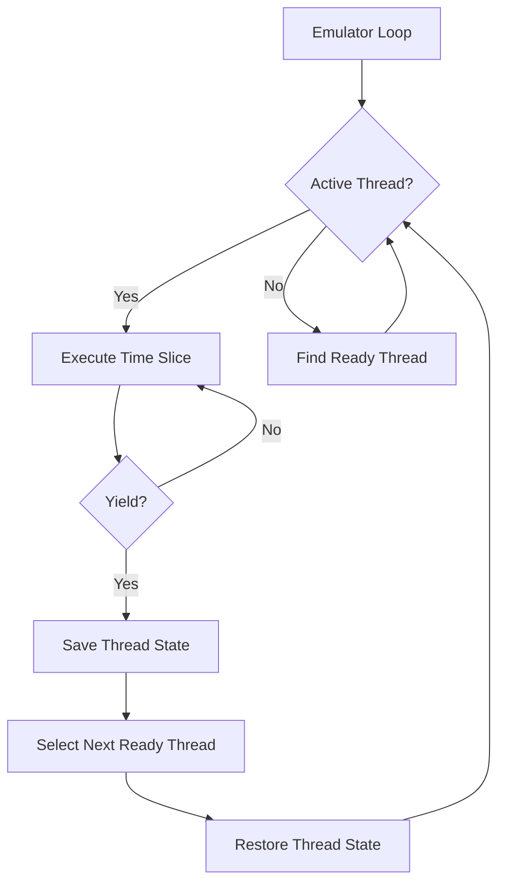

Sogen emulates Windows threading using a **cooperative round-robin** scheduler. Unlike preemptive multithreading, threads explicitly yield control at regular intervals, allowing deterministic execution for analysis and debugging.

## Threading Model

### Cooperative Scheduling

Sogen threads are not OS threads—they exist entirely within the emulator:



Benefits:
- **Determinism**: Same inputs always produce same execution order
- **Debugging**: Easier to reproduce race conditions
- **Control**: Precise instrumentation and analysis
- **Simplicity**: No OS thread synchronization needed

### Thread Structure

From `emulator_thread.hpp:192`:

```cpp
class emulator_thread : public ref_counted_object
{
public:
    uint32_t id;                      // Thread ID (TID)
    uint64_t start_address;           // Entry point
    uint64_t argument;                // Thread argument
    
    uint64_t stack_base;              // Stack base address
    uint64_t stack_size;              // Stack size
    
    // WOW64 support
    std::optional<uint64_t> wow64_stack_base;
    std::optional<uint64_t> wow64_stack_size;
    
    // Thread state
    std::optional<NTSTATUS> exit_status;  // Set when terminated
    uint32_t suspended;                   // Suspension count
    uint64_t executed_instructions;       // Instruction count
    
    // Waiting state
    std::vector<handle> await_objects;    // Objects being waited on
    bool await_any;                       // Wait for any vs. all
    std::optional<chrono::time_point> await_time;  // Timeout
    
    // Thread Environment Block
    std::optional<emulator_object<TEB64>> teb64;
    std::optional<emulator_object<TEB32>> teb32;  // For WOW64
    
    // Saved CPU state
    std::vector<byte> last_registers;     // Register snapshot
    
    // User callbacks (window procedures, etc.)
    std::vector<callback_frame> callback_stack;
};
```

## Thread Creation

Threads are created via `NtCreateThreadEx` syscall:

```cpp
NTSTATUS handle_NtCreateThreadEx(const syscall_context& c,
                                emulator_object<handle> thread_handle,
                                uint64_t start_address,
                                uint64_t argument,
                                ULONG create_flags)
{
    // Create thread object
    const auto h = c.proc.create_thread(
        c.win_emu.memory,
        start_address,
        argument,
        STACK_SIZE,      // 256KB default
        create_flags
    );
    
    thread_handle.write(h);
    return STATUS_SUCCESS;
}
```

From `process_context.cpp`:

```cpp
handle process_context::create_thread(memory_manager& memory,
                                     uint64_t start_address,
                                     uint64_t argument,
                                     uint64_t stack_size,
                                     uint32_t create_flags,
                                     bool initial_thread)
{
    // Assign thread ID
    const auto id = ++this->spawned_thread_count;
    
    // Create thread object
    emulator_thread thread{memory, *this, start_address, argument,
                          stack_size, create_flags, id, initial_thread};
    
    // Store in handle table
    const auto handle = this->threads.store(std::move(thread));
    
    // Callback notification
    if (this->callbacks_->on_thread_create)
    {
        auto* t = this->threads.get(handle);
        this->callbacks_->on_thread_create(handle, *t);
    }
    
    return handle;
}
```

### Thread Initialization

From `emulator_thread.cpp`:

```cpp
emulator_thread::emulator_thread(memory_manager& memory,
                                const process_context& context,
                                uint64_t start_address,
                                uint64_t argument,
                                uint64_t stack_size,
                                uint32_t create_flags,
                                uint32_t id,
                                bool initial_thread)
    : memory_ptr(&memory),
      start_address(start_address),
      argument(argument),
      id(id),
      create_flags(create_flags)
{
    // Allocate stack
    this->stack_size = align_up(stack_size, 0x1000);
    this->stack_base = memory.allocate_memory(
        this->stack_size,
        memory_permission::read_write
    );
    
    // Allocate TEB (Thread Environment Block)
    this->gs_segment = emulator_allocator{memory};
    this->teb64 = this->gs_segment->reserve<TEB64>();
    
    // Initialize TEB
    this->teb64->access([&](TEB64& teb) {
        teb.NtTib.StackBase = this->stack_base + this->stack_size;
        teb.NtTib.StackLimit = this->stack_base;
        teb.ClientId.UniqueThread = this->id;
        teb.ClientId.UniqueProcess = context.peb64.read().ProcessId;
    });
    
    // WOW64: Allocate 32-bit stack and TEB
    if (context.is_wow64_process)
    {
        this->wow64_stack_size = WOW64_32BIT_STACK_SIZE;  // 1MB
        this->wow64_stack_base = memory.allocate_memory(
            *this->wow64_stack_size,
            memory_permission::read_write
        );
        
        this->teb32 = this->gs_segment->reserve<TEB32>();
        this->teb32->access([&](TEB32& teb) {
            teb.NtTib.StackBase = static_cast<uint32_t>(
                *this->wow64_stack_base + *this->wow64_stack_size);
            teb.NtTib.StackLimit = static_cast<uint32_t>(
                *this->wow64_stack_base);
        });
    }
    
    // Suspend if requested
    if (create_flags & THREAD_CREATE_FLAGS_CREATE_SUSPENDED)
        this->suspended = 1;
}
```

## Thread Scheduling

### Time Slices

Threads execute in fixed instruction quanta:

```cpp
constexpr auto MAX_INSTRUCTIONS_PER_TIME_SLICE = 0x20000;  // 131,072 instructions
```

From `windows_emulator.cpp:18`.

After each time slice, the scheduler checks if a thread switch is needed:

```cpp
void windows_emulator::on_instruction_execution(uint64_t address)
{
    auto& thread = this->current_thread();
    
    ++this->executed_instructions_;
    const auto thread_insts = ++thread.executed_instructions;
    
    // Yield every time slice
    if (thread_insts % MAX_INSTRUCTIONS_PER_TIME_SLICE == 0)
    {
        this->yield_thread();
    }
}
```

### Yielding

```cpp
void windows_emulator::yield_thread(bool alertable)
{
    this->switch_thread_ = true;
    this->current_thread().apc_alertable = alertable;
    this->emu().stop();  // Stop instruction execution
}
```

This signals the main loop to switch threads.

### Thread Selection

From `windows_emulator.cpp:211`:

```cpp
bool switch_to_next_thread(windows_emulator& win_emu)
{
    perform_context_switch_work(win_emu);  // Cleanup terminated threads
    
    auto& context = win_emu.process;
    bool next_thread = false;
    
    // Try threads after current thread (round-robin)
    for (auto& t : context.threads | std::views::values)
    {
        if (next_thread)
        {
            if (switch_to_thread(win_emu, t))
                return true;
            continue;
        }
        
        if (&t == context.active_thread)
            next_thread = true;
    }
    
    // Wrap around: try threads from beginning
    for (auto& t : context.threads | std::views::values)
    {
        if (switch_to_thread(win_emu, t))
            return true;
    }
    
    return false;  // No ready threads
}
```

### Thread Readiness

From `emulator_thread.cpp:62`:

```cpp
bool emulator_thread::is_thread_ready(process_context& process,
                                     utils::clock& clock)
{
    // Terminated?
    if (this->is_terminated())
        return false;
    
    // Suspended?
    if (this->suspended > 0)
        return false;
    
    // Waiting for objects?
    if (!this->await_objects.empty())
    {
        // Check if any/all objects are signaled
        bool ready = this->await_any ? false : true;
        
        for (const auto& h : this->await_objects)
        {
            const bool signaled = is_object_signaled(process, h, this->id);
            
            if (this->await_any)
                ready |= signaled;   // Any signaled
            else
                ready &= signaled;   // All signaled
        }
        
        if (!ready)
        {
            // Check timeout
            if (!this->is_await_time_over(clock))
                return false;
        }
        
        // Ready: clear wait state
        this->await_objects.clear();
        this->mark_as_ready(STATUS_SUCCESS);
    }
    
    // Waiting for message?
    if (this->await_msg.has_value())
    {
        // Check if matching message is available
        if (!this->peek_pending_message(...))
            return false;
    }
    
    // Waiting for alert?
    if (this->waiting_for_alert)
    {
        if (!this->alerted && this->pending_apcs.empty())
            return false;
    }
    
    return true;
}
```

### Context Switching

```cpp
bool switch_to_thread(windows_emulator& win_emu, emulator_thread& thread,
                     bool force = false)
{
    // Check if ready
    if (!force && !thread.is_thread_ready(win_emu.process, win_emu.clock()))
        return false;
    
    auto& active = win_emu.process.active_thread;
    
    // Save current thread state
    if (active && active != &thread)
    {
        active->save(win_emu.emu());
        
        // Callback notification
        win_emu.callbacks.on_thread_switch(*active, thread);
    }
    
    // Restore new thread state
    active = &thread;
    thread.restore(win_emu.emu());
    thread.setup_if_necessary(win_emu.emu(), win_emu.process);
    
    // Handle pending APCs
    if (!thread.pending_apcs.empty() && thread.apc_alertable)
    {
        dispatch_next_apc(win_emu, thread);
    }
    
    return true;
}
```

## Thread Synchronization

### Waiting for Objects

```cpp
NTSTATUS handle_NtWaitForSingleObject(const syscall_context& c,
                                     handle object_handle,
                                     BOOLEAN alertable,
                                     emulator_object<LARGE_INTEGER> timeout)
{
    auto& thread = c.win_emu.current_thread();
    
    // Check if already signaled
    if (is_object_signaled(c.proc, object_handle, thread.id))
        return STATUS_SUCCESS;
    
    // Set wait state
    thread.await_objects = {object_handle};
    thread.await_any = false;
    thread.apc_alertable = alertable;
    
    // Set timeout
    if (timeout.value())
    {
        const auto timeout_val = timeout.read();
        if (timeout_val.QuadPart < 0)
        {
            // Relative timeout
            const auto duration = std::chrono::microseconds(
                -timeout_val.QuadPart / 10);
            thread.await_time = c.win_emu.clock().steady_now() + duration;
        }
    }
    
    // Yield to scheduler
    c.win_emu.yield_thread(alertable);
    
    // Status will be set when thread becomes ready
    return STATUS_PENDING;
}
```

### Asynchronous Procedure Calls (APCs)

APCs allow queuing work to a specific thread:

```cpp
struct pending_apc
{
    uint32_t flags;
    uint64_t apc_routine;      // Function to call
    uint64_t apc_argument1;
    uint64_t apc_argument2;
    uint64_t apc_argument3;
};
```

From `emulator_thread.hpp:12`.

When a thread is alertable and has pending APCs:

```cpp
void dispatch_next_apc(windows_emulator& win_emu, emulator_thread& thread)
{
    const auto next_apc = thread.pending_apcs.front();
    thread.pending_apcs.erase(thread.pending_apcs.begin());
    
    // Build context on stack
    struct {
        CONTEXT64 context;
        CONTEXT_EX context_ex;
        KCONTINUE_ARGUMENT continue_argument;
    } stack_layout;
    
    // Save current context
    cpu_context::save(win_emu.emu(), stack_layout.context);
    
    // Set APC arguments
    stack_layout.context.P1Home = next_apc.apc_argument1;
    stack_layout.context.P2Home = next_apc.apc_argument2;
    stack_layout.context.P3Home = next_apc.apc_argument3;
    stack_layout.context.P4Home = next_apc.apc_routine;
    
    // Push to stack
    const auto initial_sp = win_emu.emu().reg(x86_register::rsp);
    const auto new_sp = align_down(initial_sp - sizeof(stack_layout), 0x100);
    win_emu.emu().write_memory(new_sp, stack_layout);
    win_emu.emu().reg(x86_register::rsp, new_sp);
    
    // Jump to APC dispatcher (KiUserApcDispatcher)
    win_emu.emu().reg(x86_register::rip,
                     win_emu.process.ki_user_apc_dispatcher);
}
```

## Thread Termination

Threads can terminate via:

1. **Return from entry point**: `RtlUserThreadStart` calls `NtTerminateThread`
2. **Explicit termination**: `NtTerminateThread` syscall
3. **Process exit**: All threads terminated when process exits

```cpp
NTSTATUS handle_NtTerminateThread(const syscall_context& c,
                                 handle thread_handle,
                                 NTSTATUS exit_status)
{
    if (thread_handle.is_pseudo_current_thread())
    {
        // Terminate current thread
        c.win_emu.current_thread().exit_status = exit_status;
        c.win_emu.yield_thread();
        return STATUS_SUCCESS;
    }
    
    // Terminate other thread
    auto* thread = c.proc.threads.get(thread_handle);
    if (!thread)
        return STATUS_INVALID_HANDLE;
    
    thread->exit_status = exit_status;
    return STATUS_SUCCESS;
}
```

Terminated threads are cleaned up during context switch:

```cpp
void perform_context_switch_work(windows_emulator& win_emu)
{
    auto& threads = win_emu.process.threads;
    
    // Remove terminated threads with no references
    for (auto it = threads.begin(); it != threads.end();)
    {
        if (!it->second.is_terminated() || it->second.ref_count > 0)
        {
            ++it;
            continue;
        }
        
        // Notify callback
        if (win_emu.callbacks.on_thread_terminated)
            win_emu.callbacks.on_thread_terminated(it->first, it->second);
        
        // Erase thread
        it = threads.erase(it).first;
    }
}
```

## Next Steps

- [Architecture](/concepts/architecture) - Overall emulator design
- [Syscall Emulation](/concepts/syscall-emulation) - Thread-related syscalls
- [Memory Management](/concepts/memory-management) - Thread stack allocation
- [Exception Handling](/concepts/exception-handling) - Per-thread exception dispatch