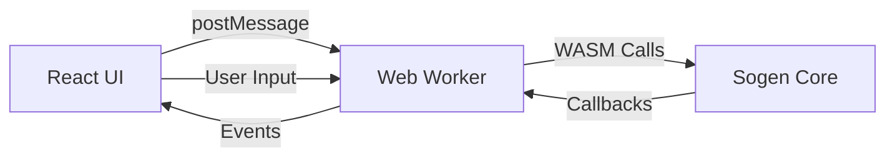

The Sogen web playground at [sogen.dev](https://sogen.dev) provides a browser-based Windows emulator that runs entirely in your browser using WebAssembly. This offers additional isolation and safety when analyzing potentially malicious software.

## Why Use the Web Version?

### Enhanced Safety

The web version provides multiple layers of isolation:

<Card title="Browser Sandbox" icon="shield">
The browser's security sandbox provides an additional layer of protection beyond the emulator itself.
</Card>

<Card title="No Host Access" icon="lock">
WebAssembly code runs in a restricted environment with no direct access to your filesystem or system resources.
</Card>

<Card title="Network Isolation" icon="network-wired">
Network operations are controlled by the browser's security policies and CORS restrictions.
</Card>

<Warning>
While the web version provides additional safety, caution is still advised when analyzing malware. Host isolation might not be perfect.
</Warning>

## Features

The web playground includes:

- **Full Windows Emulation**: Same syscall-level emulation as the desktop version
- **Interactive Console**: Real-time output and logging
- **File Upload**: Drag and drop executables and supporting files
- **Virtual Filesystem**: Browser-based filesystem using IndexedDB
- **PE File Analysis**: Built-in PE header viewer and icon extraction
- **Execution Control**: Start, stop, and monitor program execution
- **Registry Support**: Pre-configured Windows registry

## Getting Started

<Steps>

### Visit the Playground

Navigate to [sogen.dev](https://sogen.dev) in a modern browser.

<Note>
The web version requires a browser with WebAssembly support and SharedArrayBuffer. Chrome, Firefox, and Edge are recommended.
</Note>

### Upload Your Executable

Click the upload area or drag and drop your Windows executable (`.exe`) file.

Supported file types:
- Windows PE executables (`.exe`)
- Dynamic-link libraries (`.dll`) - for analysis, not execution
- Supporting files (config files, data files, etc.)

### Configure Execution

Optionally configure:
- Command-line arguments
- Working directory
- Additional files to include in the virtual filesystem

### Run the Program

Click "Run" to start emulation. Monitor the console output for:
- Syscall traces
- Memory operations
- Network activity
- Execution flow

</Steps>

## Web-Specific Features

### Virtual Filesystem

The web version uses a virtual filesystem backed by IndexedDB:

```
C:/
├── Windows/
│   ├── System32/       (System DLLs)
│   └── SysWOW64/       (32-bit DLLs on 64-bit)
├── Users/
│   └── User/
│       └── Desktop/    (Upload location)
└── Program Files/
```

Uploaded files are placed in `C:/Users/User/Desktop/` by default.

### File Persistence

Files uploaded to the virtual filesystem persist across sessions using IndexedDB. To clear:

1. Click the Settings icon
2. Select "Clear Filesystem"
3. Confirm the action

### PE File Viewer

The playground includes a PE file analyzer:

- **Headers**: View DOS, NT, and Optional headers
- **Sections**: Examine section names, sizes, and characteristics
- **Imports**: List imported DLLs and functions
- **Exports**: View exported functions
- **Resources**: Extract and view resources including icons

### Icon Extraction

The web interface automatically extracts and displays executable icons:

1. Upload an executable
2. The icon appears in the file list
3. Click to view full-size

## Building the Web Version

To build Sogen for WebAssembly locally:

### Prerequisites

- [Emscripten SDK](https://emscripten.org/docs/getting_started/downloads.html)
- CMake 3.20+
- Node.js 16+ (for the frontend)

### Build Steps

<Steps>

### Activate Emscripten

```bash
source /path/to/emsdk/emsdk_env.sh
```

### Configure with CMake

```bash
cmake --preset=emscripten
```

### Build the WebAssembly module

```bash
cmake --build build/emscripten --config Release
```

### Build the frontend

```bash
cd page
npm install
npm run build
```

### Serve locally

```bash
npm run preview
```

</Steps>

## Architecture

The web version consists of:

### WebAssembly Module

The core emulator compiled to WebAssembly:
- Unicorn Engine (emulation backend)
- Windows syscall implementations
- PE loader and module manager
- Registry and filesystem emulation

### Web Worker

Execution runs in a Web Worker (`emulator-worker.js`) to:
- Prevent blocking the main UI thread
- Enable SharedArrayBuffer for threading
- Provide better performance

### Frontend

React-based UI built with:
- **React**: UI framework
- **TypeScript**: Type-safe development
- **Vite**: Build tool and dev server
- **Tailwind CSS**: Styling
- **Radix UI**: Accessible components

### Communication Flow



## Browser Compatibility

### Requirements

- **WebAssembly**: All modern browsers
- **SharedArrayBuffer**: Required for threading
- **IndexedDB**: For virtual filesystem persistence

### Enabling SharedArrayBuffer

SharedArrayBuffer requires specific HTTP headers:

```http
Cross-Origin-Opener-Policy: same-origin
Cross-Origin-Embedder-Policy: require-corp
```

These are configured in the hosting environment.

### Tested Browsers

- ✅ Chrome 90+
- ✅ Firefox 90+
- ✅ Edge 90+
- ✅ Safari 15.2+ (with caveats)
- ❌ Internet Explorer (not supported)

## Limitations

The web version has some limitations compared to the desktop version:

### Performance

WebAssembly performance is typically 50-70% of native code. CPU-intensive programs may run slower.

### Memory

Browsers limit WebAssembly memory:
- Maximum: 2-4GB depending on browser
- Large programs may exceed available memory

### Network

Network operations are restricted:
- Subject to CORS policies
- Cannot make arbitrary TCP/UDP connections
- WebSocket support available

### File System

Virtual filesystem limitations:
- No direct host filesystem access
- Files must be uploaded manually
- Limited total storage (IndexedDB quotas)

### Debugging

The web version does not support:
- GDB remote debugging
- External debugger attachment
- Direct memory inspection tools

## Advanced Usage

### Embedding in Your Site

You can embed the Sogen emulator in your own web application:

```typescript
import { createEmulator } from './emulator'

const emulator = await createEmulator({
  wasmPath: '/path/to/analyzer.wasm',
  workerPath: '/path/to/emulator-worker.js'
})

// Load executable
await emulator.loadFile('program.exe', executableData)

// Set up callbacks
emulator.onOutput = (text) => console.log(text)
emulator.onExit = (code) => console.log('Exit:', code)

// Run program
await emulator.run(['arg1', 'arg2'])
```

### Custom Registry

Provide a custom registry configuration:

```typescript
const registryData = await fetch('/custom-registry.zip')
  .then(r => r.arrayBuffer())

await emulator.loadRegistry(registryData)
```

### File Operations

Manage the virtual filesystem:

```typescript
// Write file
await emulator.writeFile('C:/config.ini', configData)

// Read file
const data = await emulator.readFile('C:/output.txt')

// List directory
const files = await emulator.listDirectory('C:/Users/User')

// Delete file
await emulator.deleteFile('C:/temp.dat')
```

## Privacy and Security

The web playground is designed with privacy in mind:

### Data Processing

- All processing happens **client-side** in your browser
- Uploaded files are **not sent to any server**
- No telemetry or analytics on uploaded executables
- Virtual filesystem is **stored locally** (IndexedDB)

### Network Isolation

Programs running in the emulator:
- Cannot access your local network directly
- Are subject to browser security policies
- Can only make HTTP(S) requests allowed by CORS

### Clearing Data

To remove all data:

1. Clear the virtual filesystem (Settings → Clear Filesystem)
2. Clear browser storage for sogen.dev
3. Close the browser tab

## Troubleshooting

### SharedArrayBuffer Errors

If you see "SharedArrayBuffer is not defined":

1. Ensure you're using HTTPS (required for security headers)
2. Check that your browser supports SharedArrayBuffer
3. Verify the site's HTTP headers are correctly configured

### Out of Memory

If the emulator runs out of memory:

1. Close other browser tabs
2. Use a 64-bit browser
3. Try a smaller/simpler executable
4. Use the desktop version for large programs

### Performance Issues

If execution is slow:

1. Close unnecessary browser tabs
2. Disable browser extensions
3. Use Chrome or Edge (typically faster WebAssembly)
4. Consider using the desktop version for better performance

### Files Not Persisting

If uploaded files disappear:

1. Check browser storage settings
2. Ensure IndexedDB is enabled
3. Verify sufficient storage quota
4. Check for private browsing mode (may not persist)
